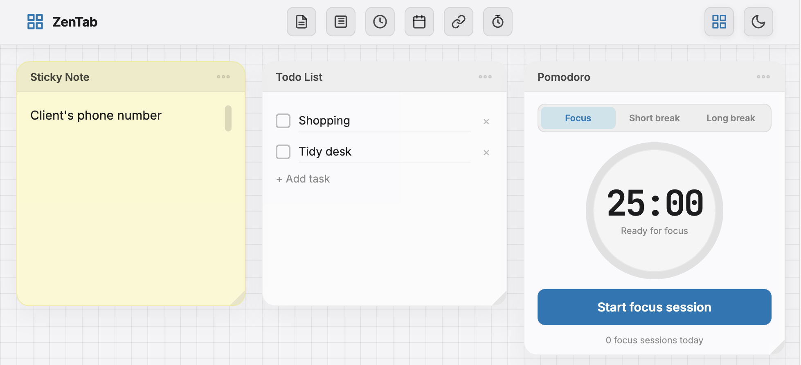

# Zen Tab

A customizable browser app to help you focused and maintain your Zen.

Features draggable, resizable widgets designed for focus and daily productivity.

## Widgets

- **Clock** — Large digital display with 12h/24h toggle. Font scales with widget size.
- **Sticky Note** — Free-form text area (pale yellow background in light mode).
- **Todo List** — Checkbox list with strikethrough on completion, inline editing, `[Enter]` to add.
- **Calendar** — Monthly grid with prev/next/Today navigation; today is highlighted.
- **Pomodoro** - Timer widget for Pomodoro technique. Focus mode, short break, and long break options.

## Usage

- **Add a widget** — click the *Add Widget* button in the top bar and select a widget type.
- **Delete a widget** — click the ✕ button on its title bar and confirm the prompt.
- **Move a widget** — drag by the gripper handle (⠿) on its title bar; positions snap to a 40px grid.
- **Resize a widget** — drag the resize handle in the bottom-right corner.
- **Theme** — click the sun/moon icon to toggle between dark and light mode.

Widget layout and content are saved in your browser's data.

## License

GPL v3

## Author

Russell Dickenson
